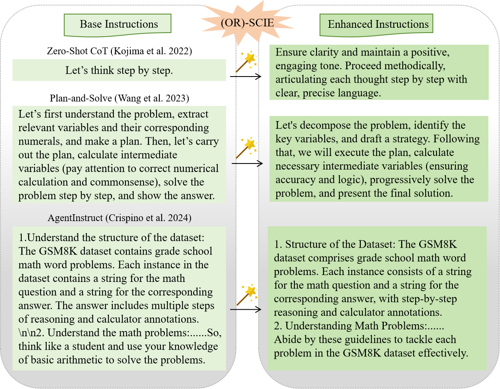

<h1 align="center"> Eliciting Causal Abilities in Large Language Models for Reasoning Tasks </h1>

<p align="center"> 
    <!--<a href="https://arxiv.org/abs/2410.23856"></a>-->
</p>

<div align="center">
    
    <br>
    <em>llustrative examples demonstrating the purpose of our research problem.</em>
</div>

## Abstract
Prompt optimization automatically optimizes prompting expressions, unlocking the full potential of LLMs in downstream tasks. However, current prompt optimization methods are costly to train and lack sufficient interpretability. This paper proposes enhancing LLMs' reasoning performance by eliciting their causal inference ability from prompting instructions to correct answers. Specifically, we introduce the \textit{Self-Causal Instruction Enhancement} (SCIE) method, which enables LLMs to generate high-quality, low-quantity observational data, then estimate the causal effect based on this data, and ultimately generate instructions with the optimized causal effect. In SCIE, the instructions are treated as the treatment, and proxy features are used to process natural language, establishing causal relationships through proxy treatments between instructions and downstream tasks. Additionally, we propose applying \textit{Object-Relational} (OR) principles, where the uncovered causal relationships are treated as the inheritable class across task objects, ensuring low-cost reusability. Extensive experiments demonstrate that our method effectively generates instructions that enhance reasoning performance with reduced training cost, leveraging interpretable textual features to provide clear and actionable insights.

## Dependency requirements
The code has been verified to work under `Python 3.12.4` with the following dependencies:

```
- openai 1.41.1
- causalnlp 0.8.0
- open-interpreter 0.3.7
- replicate 0.31.0
```

## Usage

### 1. Generate `instructions_data`
```bash
python prepare_data_1.py --base_instruction XXXX --api_key XXXX --base_url XXXX --model XXXX 
#Specify the base instruction, base URL, API key, and the LLM to be used.
```

### 2. Generate observational data
```bash
python prepare_data_2.py --api_key XXXX --dataset ./input-dataset/XXXX  
# Specify a input-dataset. If not specified, the default is all datasets.
```

### 3. `generate_enhanced_instructions`
```bash
python generate_enhanced_instructions_1.py --data XXXX  --col_range XXXX --ignore_cols XXXX
# Specify a generated observational dataset, the proxy feature rage, and the ignore columns.

python generate_enhanced_instructions_2.py --data XXXX  --col_range XXXX --ignore_cols XXXX --api_key XXXX  
# Note: except specify the arguments, the prompting content in generate_new_instructions_2.py need to be substitued according to the results in generate_enhanced_instructions_1.py.
```

### 4. `evaluate`
```bash
python evaluate.py --base_instruction XXXX --enh_instruction XXXX --data ./input-dataset/xxxx --api_key XXXX --base_url xxxx --model xxxx
# The enh_instruction can be obtained from generate_enhanced_instructions_2.py.
```
